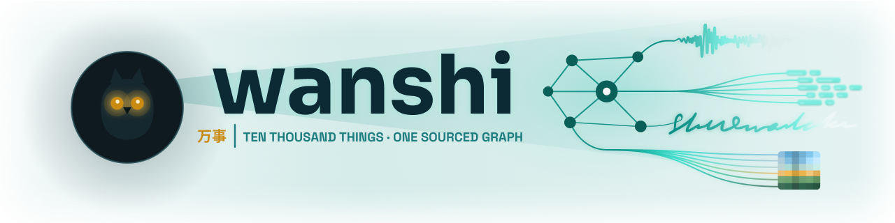

# wanshi

<picture>
  <source media="(prefers-color-scheme: dark)" srcset="docs/assets/readme-banner-dark.png">
  <source media="(prefers-color-scheme: light)" srcset="docs/assets/readme-banner-light.png">
  
</picture>


> A local-first CLI that reads ten thousand things — code, docs, PDFs, audio, transcripts — and builds one knowledge graph that remembers where every fact came from.

`wanshi` extracts entities and relations from a file tree and merges them into a single graph. It runs on local models via [Ollama](https://ollama.ai) by default, or any OpenAI-compatible endpoint. Facts carry provenance and a bi-temporal axis, an inline grounding gate filters ungrounded claims, and the graph is a drop-in producer for the MCP memory server, Graphiti, and KBLaM/LoRA training exports.

It's a working CLI and a research platform in equal measure — the long game is domain-tuned extraction feeding knowledge injection into small local models.

---

> **Command shorthand:** examples below write `wanshi` for the run command — the global CLI once you've run `npm i -g @wanshi-kg/wanshi`. From a source checkout it's `npx ts-node ./src/index.ts` (dev) or `node ./dist/index.js` (built).

## Contents

[What's distinctive](#whats-distinctive) · [Supported inputs](#supported-inputs) · [Install](#install) · [Quick start](#quick-start) · [CLI reference](#cli-reference) · [Output formats](#output-formats) · [Local model guidance](#local-model-guidance) · [Quality metrics](#quality-metrics) · [Architecture](#architecture) · [Development](#development)

## What's distinctive

Most text→KG tools stop at "extract triples." `wanshi` is built around the parts that come after:

- **Provenance, not just facts.** Every observation records its `source`/`speaker` and a Graphiti-style bi-temporal axis (`validAt`/`invalidAt` for world-time, `createdAt`/`expiredAt` for system-time). The same fact from two speakers stays as two attributed observations, never one flattened string.
- **A grounding gate.** Each extracted fact is scored against its source chunk and can be flagged or dropped before it reaches the output — keyword overlap as a cheap pre-filter, with an optional local NLI checker (MiniCheck) for the uncertain cases. It won't record what it can't verify against the source.
- **Closed-vocabulary extraction.** An optional corpus pre-pass builds a glossary of canonical entity/relation types, which then *constrains* extraction — so a large corpus doesn't fragment into hundreds of one-off types.
- **Transcript-aware ingestion.** Speaker-labeled transcripts and chat exports are split into speaker-pure chunks, so a speaker becomes per-fact provenance rather than a polluting entity.
- **Beyond plain text.** A structured source can map straight to graph — a SQLite `.db` becomes tables→types, rows→entities, foreign-keys→edges with no LLM — and a document's own links and citations become deterministic edges, optionally fetching the cited work to ground the claim.
- **Memory-store interop.** `mcp-jsonl` output is byte-compatible with the official [MCP memory server](https://github.com/modelcontextprotocol/servers/tree/main/src/memory) — point it at the file and query your graph from Claude Code/Desktop. No store to build.
- **Training-data exports.** Emit KBLaM `(entity, property, value)` triples or quality-filtered LoRA/SFT chat examples straight from a graph.
- **Resumable runs.** Per-chunk checkpoints survive interrupts and exhausted API credits; re-run the same command to continue.

## Supported inputs

| Format | Extensions | Handling |
| ------ | ---------- | -------- |
| Text / source code | `.txt`, `.ts`, `.js`, `.py`, `.go`, `.rs`, … | Direct / code-aware extraction |
| Markdown | `.md` | Markdown-aware parsing |
| LaTeX | `.tex` | De-TeX'd to readable prose; `\cite{}` keys feed the citation pipeline |
| EPUB | `.epub` | Unzipped and parsed per chapter (adm-zip + cheerio + html-to-text) |
| Jupyter | `.ipynb` | Cell-aware (markdown narrative + fenced code); cell outputs opt-in |
| Transcripts | speaker-labeled `*.parakeet.txt`/`*.whisper.txt`, transcript/turn JSON, Claude/ChatGPT exports | Speaker-pure chunks with per-fact `speaker`/`occurredAt` |
| Email | `.eml`, `.mbox` | Per-message turns (sender → `speaker`, `Date` → `validAt`); thread-aware; quoted replies stripped |
| Chat exports | WhatsApp `.txt`, Telegram/Discord/Slack `.json` | Per-message speaker-pure turns via a per-platform parser |
| Subtitles | `.srt`, `.vtt` | Caption text (timecodes/styling stripped); VTT `<v>` voice tags → speakers |
| JSON | `.json`, `.jsonl`, `.geojson` | Structure-aware chunking (splits on JSON structure, never mid-object) |
| PDF | `.pdf` | Page text (`pdf2json`), or a richer engine via `--pdf-engine tesseract\|docling\|marker\|chandra\|mistral` |
| Office | `.docx`, `.xlsx`, `.pptx` | Via officeparser |
| HTML / RTF | `.html`, `.htm`, `.rtf` | cheerio / RTF parsing |
| Images | `.jpg`, `.png`, `.gif`, `.webp`, `.tiff`, `.heic`, `.avif` | Vision model required |
| Audio / Video | `.mp3`, `.wav`, `.m4a`, `.flac`, `.mp4`, `.mkv`, `.webm`, … | Whisper transcription, or `--asr-engine dual` (VAD + dual-STT + diarization) |

## Install

Requires **Node.js 18+** and **[Ollama](https://ollama.ai)** running locally (needed for the default local generation + embeddings path; optional only if you point *both* at an OpenAI-compatible provider).

```bash
# Install the published CLI (gives you the `wanshi` command)
npm install -g @wanshi-kg/wanshi

# Default local models
ollama pull llama3.2                 # generation
ollama pull nomic-embed-text         # embeddings
```

Or run from a source checkout (for development / contributing):

```bash
git clone https://github.com/wanshi-kg/wanshi
cd wanshi
npm install
npm run build   # optional; ts-node works directly
```

## Quick start

```bash
# Process a directory with defaults
wanshi -i ./my-project -o knowledge-graph.json

# Pick a model and output format
wanshi -i ./src -m qwen3:8b --export-format jsonl -o kg.jsonl

# Config file (recommended for anything non-trivial)
wanshi --config config.yaml
```

### Configuration

The config file uses a **nested** shape (the source of truth is the Zod schema in `src/config/`); CLI flags stay flat. Run `wanshi schema` to print the full JSON Schema.

```yaml
input: ./my-project
filter: ["**/*.ts", "**/*.md"]
exclude: ["**/node_modules/**", "**/dist/**"]
output: knowledge-graph.jsonl
description: "TypeScript project source code"

llm:
  provider: ollama          # ollama | openai (OpenAI-compatible)
  model: gemma3:4b
  host: http://localhost:11434
  contextLength: 12000
  temperature: 0.1

embeddings:                 # independent from generation — keep local & free
  provider: ollama
  model: nomic-embed-text
  host: http://localhost:11434

chunking: { mode: enabled, size: 4000, overlap: 100 }
retrieval: { mode: enabled, limit: 3 }

merging:
  enableSimilarityMerging: true
  entitySimilarityThreshold: 0.9
  observationSimilarityThreshold: 0.7

export: { format: jsonl }
```

### Cloud generation + resume

Point generation at any OpenAI-compatible endpoint (`provider: openai`, `host` = base URL), keep embeddings local so dedup/merge stays free, and enable `resume` so an interrupted run continues without reprocessing.

```yaml
llm:
  provider: openai
  host: https://openrouter.ai/api/v1
  apiKey: sk-or-...          # or $OPENAI_API_KEY / $WANSHI_API_KEY
  model: google/gemma-3-27b-it
embeddings:
  provider: ollama
  model: nomic-embed-text
resume:
  enabled: true             # writes <output>.checkpoint.jsonl
```

If the run dies mid-way, just run the same command again — finished chunks are skipped. **Ctrl+C once** finishes the in-flight chunk, checkpoints it, and writes the partial graph before exiting; press again to force-quit.

A chunk is reused only when its **file content, chunk size/overlap, model, and prompt version** all match — these are folded into the checkpoint key. Files are keyed by path *relative to `--input`*, so relocating the whole tree keeps checkpoints valid; only editing a file re-runs it.

### Other modes

```bash
# Watch: update the graph as files change
wanshi --config config.yaml --watch

# Multimedia (images + audio transcription)
wanshi -i ./media --images enabled --asr enabled --whisper-model medium -m llava:7b

# GraphViz DOT for visualization
wanshi -i ./src --export-format dot -o graph.dot && dot -Tsvg graph.dot -o graph.svg

# Re-export an existing graph (no LLM calls)
wanshi --export-only -i ./knowledge-graph.json --export-format kblam -o ./kb.jsonl
```

## CLI reference

### Core

| Option | Default | Description |
| ------ | ------- | ----------- |
| `-i, --input <path>` | `.` | Input directory |
| `-f, --filter <glob>` | `**/*` | Include pattern |
| `-e, --exclude <glob...>` | — | Exclude patterns |
| `-o, --output <path>` | `knowledge-graph.json` | Output file |
| `-d, --description <text>` | — | Content description for LLM context |
| `--config <file>` | — | YAML/JSON config file |

### LLM

| Option | Default | Description |
| ------ | ------- | ----------- |
| `--provider <name>` | `ollama` | `ollama` or `openai` (any OpenAI-compatible endpoint) |
| `-m, --model <name>` | `llama3.2` | Ollama tag or provider model id |
| `-h, --host <url>` | `http://localhost:11434` | Ollama host, or OpenAI-compatible base URL |
| `--api-key <key>` | — | Falls back to `$OPENAI_API_KEY` / `$WANSHI_API_KEY` (or `$KG_API_KEY`, legacy) |
| `--temperature <n>` | `0.1` | Sampling temperature |
| `--repeat-penalty <n>` | `1.1` | Ollama only (>1.0 discourages repetition) |
| `--context-length <n>` | `8192` | Context window (Ollama only) |
| `--max-tokens <n>` | provider default | Raise (or lower `--chunk-size`) if graph JSON truncates mid-output |
| `--seed <n>` | — | Reproducibility seed (Ollama only) |
| `-s, --system <prompt\|path>` | — | Custom system prompt or template path |

### Embeddings (independent from generation)

| Option | Default | Description |
| ------ | ------- | ----------- |
| `--embeddings-provider <name>` | `ollama` | `ollama` or `openai` |
| `--embeddings-model <name>` | `nomic-embed-text` | Embeddings model |
| `--embeddings-host <url>` | `http://localhost:11434` | Host / base URL |
| `--embeddings-max-input-chars <n>` | `1024` | Truncate embedding inputs (safe for 512-token models; raise for cloud) |

### Processing & retrieval

| Option | Default | Description |
| ------ | ------- | ----------- |
| `--chunking <mode>` | `enabled` | `enabled\|disabled\|auto` |
| `-c, --chunk-size <n>` | `2000` | Max chunk size (chars) |
| `--overlap-size <n>` | `100` | Chunk overlap |
| `--retrieval <mode>` | `enabled` | `enabled\|disabled\|auto` |
| `--retrieval-limit <n>` | `3` | Retrieved context entities per chunk |
| `--retrieval-scope <mode>` | `chunk` | `chunk` (per-chunk) or `file` (once, reused) |
| `--json-strategy <mode>` | `structural` | `structural` (split on JSON structure) or `raw` |

### Media & classification

| Option | Default | Description |
| ------ | ------- | ----------- |
| `--asr <mode>` | `enabled` | `enabled\|disabled\|auto` |
| `--whisper-model <name>` | `medium` | `tiny\|base\|small\|medium\|large` |
| `--language <lang>` | `auto` | Language code or `auto` |
| `--translate` | `false` | Translate audio to English |
| `--images <mode>` | `auto` | `enabled\|disabled\|auto` (vision model required) |
| `--pdf-engine <engine>` | `pdf2json` | `pdf2json\|tesseract\|docling\|marker\|chandra\|mistral` — PDF reading engine; hardware-aware ladder tesseract (CPU/WASM) → pdf2json → docling → marker → chandra (handwriting VLM) → mistral (cloud). Non-default engines degrade to `pdf2json` on failure |
| `--asr-engine <engine>` | `whisper` | `whisper\|dual` — `dual` = vendored Python VAD + Parakeet/Whisper dual-STT + diarization (Apple-Silicon) |
| `--classifier <mode>` | `disabled` | `disabled\|heuristic\|llm\|cascade` — drives domain prompt hints and scopes `entityType` to a per-domain enum *(experimental)* |
| `--trace` | `false` | Emit a structured decision run-trace to `<output>.trace.jsonl` *(debug/observability)* |

### Merging, grounding, corpus glossary

| Option | Default | Description |
| ------ | ------- | ----------- |
| `--entity-similarity-threshold <n>` | `0.9` | Jaro-Winkler entity dedup (0–1) |
| `--observation-similarity-threshold <n>` | `0.9` | Embedding similarity (0–1) |
| `--enable-similarity-merging` | `true` | Enable entity deduplication |
| `--grounding <mode>` | `disabled` | `disabled` · `flag` (annotate `grounded`/`groundingScore`) · `drop` (remove below threshold) |
| `--grounding-min-score <n>` | `0.5` | Min grounding score; also gates which facts the `lora` export keeps |
| `--corpus-profiling <mode>` | `disabled` | Pre-pass that builds an authoritative corpus glossary (closed vocab under v5) *(experimental)* |
| `--prompt-version <version>` | `v5` | `v5` (closed-vocab + topology hygiene) or `v4.5` (legacy) |

### Export, resume, logging

| Option | Default | Description |
| ------ | ------- | ----------- |
| `--export-format <format>` | `json` | `json\|jsonl\|mcp-jsonl\|dot\|kblam\|lora\|graphiti` |
| `--export-only` | `false` | Convert an existing graph (`--input`) to `--export-format` — no extraction |
| `--resume` | `false` | Checkpoint chunks; skip done ones on re-run |
| `--checkpoint <path>` | `<output>.checkpoint.jsonl` | Checkpoint sidecar |
| `-L, --log-level <level>` | `info` | `debug\|info\|warning\|error` |
| `-l, --log-file <path>` | — | Write logs to file |
| `-w, --watch` | `false` | Watch mode |

> Document-outline injection (`readers.outline`) and DOT styling (`export.dot`) are config-only (no CLI flags) — see the config schema.

### References & citations (opt-in; network only for web/citation fetch)

Turn the references a document already contains into deterministic edges — and, opt-in, fetch the cited work to make a citation evidence-bearing. All default **off** (offline, byte-identical run).

| Option | Default | Description |
| ------ | ------- | ----------- |
| `--reference-links` | `false` | Resolve internal links + `[[wikilinks]]` → `links_to` edges |
| `--reference-citations` | `false` | Parse bibliographies + inline ids → `cites` edges |
| `--reference-follow` | `false` | Follow resolved internal links to discover & ingest more files |
| `--reference-web` | `false` | Fetch external links (allowlist + robots + budget gated) → `references` edges |
| `--reference-citation-fetch` | `false` | Fetch a cited work's OA full text, then span-select + grounding-check the citing claim |
| `--reference-title-resolver` | `false` | Resolve id-less citations via Crossref → Semantic Scholar → OpenAlex |
| `--grobid` / `--grobid-url <url>` | `false` | Link in-text citations to their claim sentence via a local GROBID service |
| `--unpaywall-email <email>` | — | Unpaywall polite-pool email for DOI→OA (or `$UNPAYWALL_EMAIL`) |
| `--strip-references` | `false` | Quarantine a document's trailing bibliography before extraction |

### Cost & token metering

| Option | Default | Description |
| ------ | ------- | ----------- |
| `--cost` | `false` | Meter token usage + USD cost (rough pre-run estimate + exact end-of-run tally) |
| `--max-cost <n>` | — | Hard spend cap — graceful stop + checkpoint when exceeded (auto-enables `--cost`) |
| `--cost-ledger <path>` | `<output>.cost.json` | Resume-safe cumulative cost ledger |

### Image enrichment & CV (opt-in; augments the vision read, never replaces it)

| Option | Default | Description |
| ------ | ------- | ----------- |
| `--exif` | `false` | EXIF → GPS `location`, capture-time `validAt`, camera/author facts |
| `--c2pa` | `false` | C2PA content credentials → a fact-not-verdict trust observation |
| `--object-detection` | `false` | CV detector pre-pass → a VLM context line + `depicts` edges |
| `--detection-mode <mode>` | `closed` | `closed` (COCO-80) or `zero-shot` (open-vocab labels) |

### Structured-source adapters

| Option | Default | Description |
| ------ | ------- | ----------- |
| `--sqlite` | `false` | Map a `.db`/`.sqlite` directly to graph — tables → types, rows → entities, FKs → edges (no LLM) |

> **More flags.** AST seeding (`--ast`), corpus tuning (`--corpus-top-terms`, `--corpus-profile-path`),
> dual-ASR backends (`--asr-models`, `--num-speakers`), PDF-engine tuning (`--marker-use-llm`,
> `--tesseract-lang`, `--chandra-method`), grounding internals (`--grounding-checker`,
> `--grounding-model`, `--supersession`), and `--trace-path` round out the surface. Run
> **`wanshi schema`** to print the complete, authoritative option set — it's generated from the Zod
> config schema, so it never drifts from the code.

## Output formats

### JSON (`json`)

Observations are **objects**, not bare strings — each carries provenance and the bi-temporal axis. The LLM emits plain text; `wanshi` stamps the metadata deterministically from what it knows about the chunk. Unknown fields are omitted; legacy string-observation graphs still load.

```json
{
  "entities": [
    {
      "name": "knowledge_graph_builder",
      "entityType": "class",
      "observations": [
        {
          "text": "Extracts entities and relations from file content using an LLM",
          "source": "src/core/knowledge/KnowledgeGraphBuilder.ts",
          "createdAt": "2026-06-05T15:57:59.856Z"
        }
      ],
      "files": ["src/core/knowledge/KnowledgeGraphBuilder.ts"]
    },
    {
      "name": "SPEAKER_01",
      "entityType": "person",
      "observations": [
        {
          "text": "Explains that a Naïve Bayes classifier assumes word independence",
          "speaker": "SPEAKER_01",
          "source": "Olga Lesson P.parakeet.txt",
          "validAt": "2026-05-28T00:00:00Z",
          "createdAt": "2026-06-05T15:57:59.856Z"
        }
      ],
      "files": ["Olga Lesson P.parakeet.txt"]
    }
  ],
  "relations": [
    { "from": "knowledge_graph_builder", "to": "ollama_service", "relationType": ["uses", "depends_on"] }
  ]
}
```

### MCP-compatible JSONL (`mcp-jsonl`)

```jsonl
{"type":"entity","name":"knowledge_graph_builder","entityType":"class","observations":["Extracts entities and relations from file content using an LLM"]}
{"type":"relation","from":"knowledge_graph_builder","to":"ollama_service","relationType":"uses,depends_on"}
```

### GraphViz DOT (`dot`)

Styled, colored graph (one node per entity, colored edges per relation type, legend, config summary). Render with `dot -Tsvg graph.dot -o graph.svg` (or `neato`/`fdp`/`sfdp`/`circo`/`twopi`). Styling is config-only under `export.dot:` — layout, `rankdir`, `colorScheme` (`default\|scientific\|code\|minimal`), clustering by type or file, etc.

### KBLaM triples (`kblam`)

JSONL in the shape Microsoft [KBLaM](https://github.com/microsoft/KBLaM)'s `dataset_generation` ingests — **one `(entity, property, value)` per line**, each with the derived `Q`/`A`/`key_string` it encodes into a knowledge token. Property names are distinct per entity (relations contribute their predicate as the property), and keys are unique per `(name, property)` so rectangular-attention lookup is unambiguous.

```jsonl
{"name":"Recursion","property":"definition","value":"a function that calls itself","Q":"What is the definition of Recursion?","A":"The definition of Recursion is a function that calls itself.","key_string":"the definition of Recursion"}
{"name":"Recursion","property":"terminates_at","value":"BaseCase","Q":"What is the terminates_at of Recursion?","A":"The terminates_at of Recursion is BaseCase.","key_string":"the terminates_at of Recursion"}
```

### LoRA / SFT (`lora`)

Chat-format instruction examples derived from the same triples, **quality-filtered**: observations whose grounding score is below `--grounding-min-score` are dropped, so only grounded facts become training data.

```jsonl
{"messages":[{"role":"user","content":"What is the definition of Recursion?"},{"role":"assistant","content":"The definition of Recursion is a function that calls itself."}]}
```

### Graphiti (`graphiti`)

`add_triplet`-shaped `{ nodes, edges }` for ingestion into a [Graphiti](https://github.com/getzep/graphiti) temporal graph — entities → nodes (summary from observations), relations → `UPPER_SNAKE` edges with stable uuids. Per-fact valid-time rides along in the `json`/`kblam` exports.

## Local model guidance

Quality/speed trade-off for local selection. For measured numbers see the benchmark below.

| Model | Params | Quality | Speed | Notes |
| ----- | ------ | ------- | ----- | ----- |
| `qwen3:8b` | 8B | ★★★★★ | slower | highest extraction quality |
| `gemma3:4b` | 4B | ★★★★ | medium | best quality/speed balance |
| `qwen2.5-coder:1.5b` | 1.5B | ★★★ | fast | strong on source code |
| `qwen3:1.7b` | 1.7B | ★★★ | fast | good general purpose |
| `gemma3:1b` | 1B | ★★ | very fast | minimal resources |

Default embeddings: `nomic-embed-text`.

The table above is qualitative guidance. For measured, comparative numbers (wanshi vs KGGen on gold-labeled datasets) see **[Benchmarks](#benchmarks)** below — note those run on **cloud** models; local-model benchmarks are planned.

## Benchmarks

> **Scope & honesty (read first).** Every number here is **cloud inference via OpenRouter** —
> **local-model (offline-first) benchmarks are planned and not yet run** (see [What's not yet
> measured](#whats-not-yet-measured)). Comparative baselines are **re-scored under one identical
> harness, not the published figures**. The document-level result rests on **one dataset** so far.
> **MINE** is a recall-only, LLM-judge-mediated axis, reported as *context*, not a load-bearing claim.

wanshi vs **KGGen** (its real Python package), **same model for both tools**, on gold-labeled datasets.
The fair cross-tool metric is **entity-capture F1** (did the tool recover the gold entities) — both
tools emit free predicates, so typed relation-F1 understates uniformly *except* in the schema-aware
mode below. Embeddings for matching run locally (`nomic-embed-text`), semantic threshold 0.80.

**Entity capture across granularity** (deepseek-v4-pro):

| Dataset | Level | N | wanshi F1 | KGGen F1 |
| ------- | ----- | - | --------- | -------- |
| SemEval-2010 T8 | sentence | 300 | 0.422 | **0.453** |
| CrossRE | sentence | 300 | 0.786 | **0.824** |
| Re-DocRED | document | 100 | **0.677** | 0.643 |

Same shape everywhere: KGGen edges **recall**, wanshi wins **precision**. The net **flips with document
length** — on long documents KGGen over-extracts and its precision collapses, so wanshi's discipline wins.

**Claim (a) — the precision advantage grows with document length *and* model capability.** Re-DocRED
two-way (node entity-capture F1) across the model ladder:

| Model | wanshi | KGGen | wanshi win | KGGen precision | KGGen ent/doc |
| ----- | ------ | ----- | ---------- | --------------- | ------------- |
| deepseek-v4-pro | 0.677 | 0.643 | +3.4 pt | 0.530 | 21.6 |
| claude-sonnet-4.6 | 0.721 | 0.620 | +10.1 pt | 0.489 | 24.2 |
| gpt-5.4 | 0.735 | 0.561 | **+17.4 pt** | 0.402 | 32.1 |

Stronger models extract *more* (KGGen 21.6 → 32.1 entities/doc); on long docs that craters precision
(0.53 → 0.40) faster than it helps recall, while wanshi stays disciplined — so the win **widens at the
frontier**. *Confirmed across three models; rests on one document-level dataset (a second, SciERC/BioRED,
is planned).*

**Claim (b) — schema-aware typed extraction (a mode KGGen lacks).** When the **target relation schema is
known**, wanshi extracts typed relations natively via a closed vocabulary (`--relation-vocab`). Re-DocRED
triple-F1, free predicates → strict gold schema (96 Wikidata properties):

| Model | wanshi free → strict | Ign-F1 | KGGen (free) | × KGGen |
| ----- | -------------------- | ------ | ------------ | ------- |
| deepseek-v4-pro | 0.012 → 0.107 | 0.111 | 0.025 | 4× |
| claude-sonnet-4.6 | 0.016 → 0.112 | 0.116 | 0.019 | 6× |
| gpt-5.4 | 0.015 → **0.145** | 0.148 | 0.014 | **10×** |

**Ign-F1 ≈ triple-F1** on every model (Ign-F1 excludes triples seen in training) → the gains are
**generalization, not memorized facts**. KGGen has no closed-vocab mode, so it can't consume a known
ontology. *This is "schema-aware typed extraction," not "wanshi beats KGGen at relation extraction."*

**MINE (context only).** On the recall-only, judge-mediated MINE benchmark KGGen's denser extraction wins
(re-scored ~64% vs wanshi's best ~28%). MINE rewards raw triple coverage and is blind to precision, and
its judge performs fact-verification (a known-soft measurement) — so the gold-labeled results above carry
the comparative claims; MINE is reported as context, not a verdict.

**Cost & reproducibility.** Generation = cloud OpenRouter; **embeddings = local Ollama (free)**.
Representative spend (measured live via the OpenRouter credits API; wanshi extraction tokens shown, the
$ also covers the KGGen baseline):

| Cell (Re-DocRED, two-way + H4, N=100) | tokens in | tokens out | cost |
| ------------------------------------- | --------- | ---------- | ---- |
| claude-sonnet-4.6 | ~0.57 M | ~0.16 M | $6.00 |
| gpt-5.4 | ~0.43 M | ~0.19 M | $5.60 |

(OpenRouter rates at run time, ≈ $3 / $15 per Mtok in/out for the Claude tier.) Reproduce a cell with the
one harness — wanshi inline, KGGen cached, same sample list for both:

```bash
npx ts-node scripts/gold-compare.ts --dataset redocred --limit 100 \
  --model deepseek/deepseek-v4-pro --provider openai --host https://openrouter.ai/api/v1
.venv-kggen/bin/python scripts/kggen-crossre.py --model deepseek/deepseek-v4-pro \
  --samples data/redocred/compare/samples.jsonl --out data/redocred/compare/kggen.jsonl
# add --relation-vocab @data/redocred/compare/relation-vocab.txt for the schema-aware (H4) cell
```

### What's not yet measured

- **Local-model (offline-first) benchmarks** — the deployment-target floor (`gemma3:4b`-class) is *owed*;
  every number above is cloud inference. This is the next benchmark priority. *(An earlier indicative
  n=20 single-domain run hinted small `gemma3:4b` ≈ larger Gemmas on entity extraction — to be confirmed
  in the local arm.)*
- **A second document-level dataset** (SciERC / BioRED) to close the single-dataset caveat on claim (a).

## Quality metrics

Importable evaluators in `src/quality/` (also wired into `npm run benchmark`): **structural** (counts, density, type distribution), **semantic** (name quality, observation specificity, coverage), **factual** (grounding, hallucination, contradiction — this one also backs the inline grounding gate), and **consistency** (cross-file naming, type coherence), rolled into a 0–100 composite that can gate which graphs are harvested for `kblam`/`lora` training data.

## Architecture

```text
src/
├── cli/           # Commander.js CLI (process/watch/export; --export-only)
├── config/        # Single nested Zod schema — defaults, validation, `wanshi schema`
├── core/
│   ├── di/         # Async DI container + service registrations
│   ├── processor/  # File readers (transcript, email, chat, PDF/OCR, audio, …) + chunking + classifiers + AST seed
│   ├── corpus/     # Corpus pre-pass: term frequency + LLM glossary (closed vocab)
│   ├── checkpoint/ # Per-chunk resume sidecar
│   ├── llm/        # Ollama / OpenAI-compatible providers, embeddings, Handlebars prompts
│   ├── knowledge/  # KG build (LLM+Zod, provenance + grounding gate), 3-level merge, canon, references, images, vector search
│   ├── adapters/   # Structured-emit adapters (SQLite → graph fragments, no LLM)
│   ├── cv/         # Object-detection pre-pass (a signal for the model, not a verdict)
│   ├── cost/       # Token/cost metering + `--max-cost` cap
│   ├── trace/      # Debug run-trace sidecar (observability, off by default)
│   ├── pipeline/   # Post-merge transform stages
│   └── export/     # Strategy pattern: json, jsonl, mcp-jsonl, dot, kblam, lora, graphiti
├── quality/       # Importable metrics (structural, semantic, factual, consistency, composite)
├── evaluation/    # Benchmark harness (CrossRE / REBEL / RE-DocRED / SemEval-2010 T8 / MINE)
├── types/         # Interfaces and data models
└── shared/        # Logger, graceful shutdown, utilities (Jaro-Winkler, cosine, config)
```

Tests use Jest (`npm test`); mock the LLM via `ILLMProvider` for network-free unit tests.

## Development

```bash
git clone https://github.com/wanshi-kg/wanshi && cd wanshi && npm install
npx ts-node ./src/index.ts --config config.yaml   # run directly
npm run build && node ./dist/index.js --config config.yaml   # or build first
```

See [`examples/`](examples/) for integrations — `kg-telegram-sink` (Telegram → graph bot with an A/B canon config) and the legacy `kg-mail-assistant` (Gmail OAuth + email→KG prototype, reference-only) — plus programmatic usage via `ContainerFactory`.

## Acknowledgments

- **[Ollama](https://ollama.ai)** — local LLM runtime and embeddings
- **[LangChain](https://github.com/langchain-ai/langchainjs)** — text-splitting utilities
- **[OpenAI Whisper](https://github.com/openai/whisper)** (via `nodejs-whisper`) — audio transcription
- **Anthropic** — the MCP protocol, and Claude as a build partner (Cheetah 🐆 on the code, Dove 🕊️ on the audits)
- **[KBLaM](https://github.com/microsoft/KBLaM)** and **[Graphiti](https://github.com/getzep/graphiti)** — prior work this project's training exports and temporal model lean on

## License

MIT — see [LICENSE](LICENSE).

---

*Knows ten thousand things; keeps only the ones it can source.*
